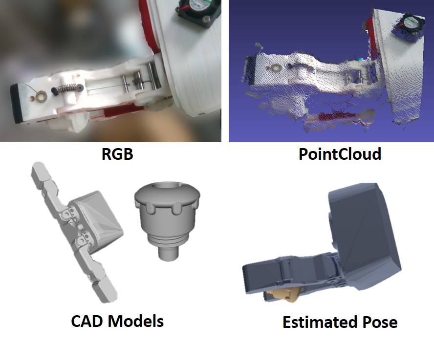
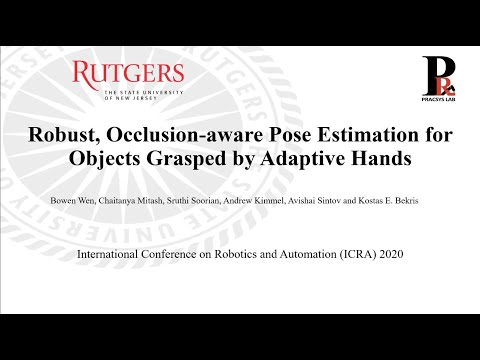
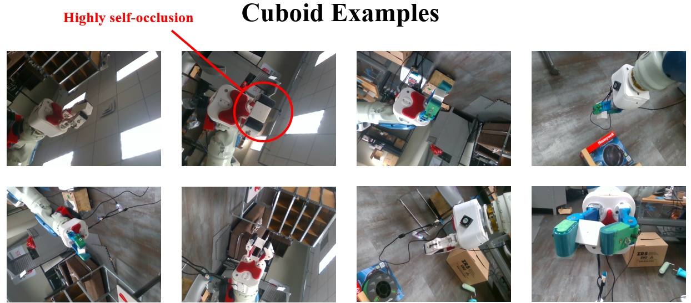
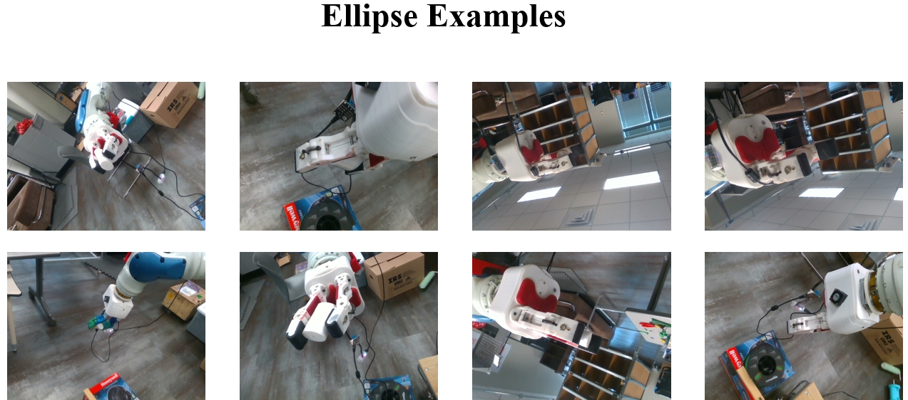
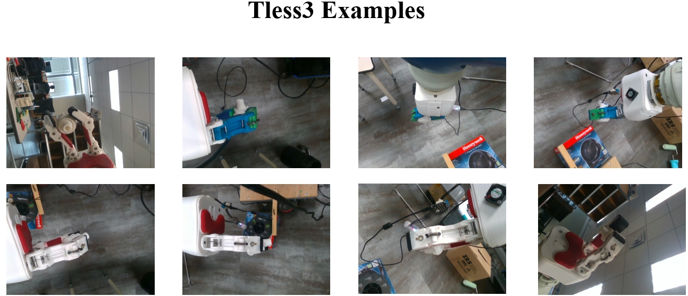
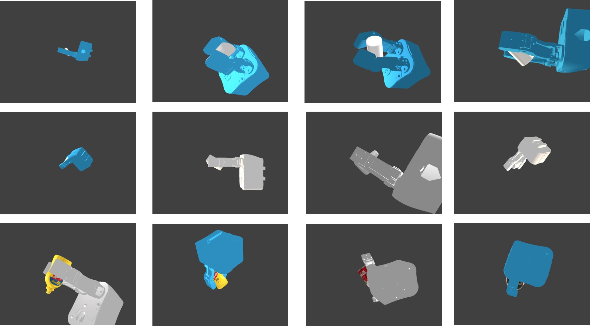

# icra20_hand_object_pose

This is the official implementation of "Robust, Occlusion-aware Pose Estimation for Objects Grasped by Adaptive Hands" published in ICRA 2020. [[PDF]](https://arxiv.org/pdf/2003.03518.pdf)
```
@article{wen2020robust,
  title={Robust, Occlusion-aware Pose Estimation for Objects Grasped by Adaptive Hands},
  author={Wen, Bowen and Mitash, Chaitanya and Soorian, Sruthi and Kimmel, Andrew and Sintov, Avishai and Bekris, Kostas E},
  journal={International Conference on Robotics and Automation (ICRA) 2020},
  year={2020}
}
```

## About


Many manipulation tasks, such as placement or
within-hand manipulation, require the object’s pose relative to
a robot hand. The task is difficult when the hand significantly
occludes the object. It is especially hard for adaptive hands,
for which it is not easy to detect the finger’s configuration.
In addition, RGB-only approaches face issues with texture-less
objects or when the hand and the object look similar. This
paper presents a depth-based framework, which aims for robust
pose estimation and short response times. It could be integrated with tracking-based methods to provide initialization or recovery from lost tracking. The approach detects the adaptive hand’s state via efficient parallel search given the
highest overlap between the hand’s model and the point cloud.
The hand’s point cloud is pruned and robust global registration
is performed to generate object pose hypotheses, which are
clustered. False hypotheses are pruned via physical reasoning.
The remaining poses’ quality is evaluated given agreement
with observed data.

## Supplementary Video:
Click to watch

[](https://www.youtube.com/watch?v=jCt0-dJAvgI)


## Dependencies
* Linux (tested on Ubuntu 16.04)
* PCL (tested on 1.9)
* OpenCV
* ROS (tested on Kinetic)
* yaml-cpp


## Datasets
Download the datasets used for evaluation in the paper.
* [real world data](https://archive.cs.rutgers.edu/archive/a/2020/pracsys/bw344/icra2020/auto_collect.tar.gz) (986 samples) : Groundtruth 6D pose.
* [synthetic data](https://archive.cs.rutgers.edu/archive/a/2020/pracsys/bw344/icra2020/simulation_data.tar.gz) (12000 samples) :
  1. Groundtruth 6D pose of everything including every finger.
  2. Groundtruth semantic segmentation of every link of the hand and object.
  3. Additional rendered images of objects under the same pose but not occluded by hand.
* [object and hand CAD models, computed PPF features](https://archive.cs.rutgers.edu/archive/a/2020/pracsys/bw344/icra2020/meshes.tar.gz).

Some example RGB images from real world data:





Some example RGB images from synthetic data:



## Install
```
bash build.sh
```

## Example run on real world data

1. After you download object and hand models, change these paths in the config_autodataset.yaml file. More explanations are in the yaml file.
```
out_dir: [your_out_dir]
rgb_path: [your_path]/example/rgb7.png
depth_path: [your_path]/example/depth7.png
palm_in_baselink: [your_path]/example/palm_in_base7.txt
leftarm_in_base: [your_path]/example/arm_left_link_7_t_7.txt
model_name: ellipse
object_model_path: [your_path]/ellipse.ply
object_mesh_path: [your_path]/raw/ellipse.obj
ppf_path: [your_path]/ppf_ellipse

urdf_path: [your_path]/meshes/hand_T42b.urdf

Hand:
  base_link:
    mesh: [your_path]/meshes/raw/base.obj
    convex_mesh: [your_path]/meshes/raw/base_convex.obj
    cloud: [your_path]/meshes/raw/base.ply
  swivel_1:
    mesh: [your_path]/meshes/raw/swivel_t42.obj
    convex_mesh: [your_path]/meshes/raw/swivel_t42_convex.obj
    cloud: [your_path]/meshes/raw/swivel_t42.ply
  swivel_2:
    mesh: [your_path]/meshes/raw/swivel_t42.obj
    convex_mesh: [your_path]/meshes/raw/swivel_t42_convex.obj
    cloud: [your_path]/meshes/raw/swivel_t42.ply
  finger_1_1:
    mesh: [your_path]/meshes/raw/proximal_t42_airtight.obj
    convex_mesh: [your_path]/meshes/raw/proximal_t42_convex.obj
    cloud: [your_path]/meshes/raw/proximal_t42_airtight.ply
  finger_1_2:
    mesh: [your_path]/meshes/raw/distal_round_t42_airtight.obj
    convex_mesh: [your_path]/meshes/raw/distal_round_t42_convex.obj
    cloud: [your_path]/meshes/raw/distal_round_t42_airtight.ply
  finger_2_1:
    mesh: [your_path]/meshes/raw/proximal_t42_airtight.obj
    convex_mesh: [your_path]/meshes/raw/proximal_t42_convex.obj
    cloud: [your_path]/meshes/raw/proximal_t42_airtight.ply
  finger_2_2:
    mesh: [your_path]/meshes/raw/distal_round_t42_airtight.obj
    convex_mesh: [your_path]/meshes/raw/distal_round_t42_convex.obj
    cloud: [your_path]/meshes/raw/distal_round_t42_airtight.ply
```


2.
```
rosrun icra20_manipulation_pose  main_realdata_auto [path_to_your_config_file]
```

In the end, the program will save estimated object (best.obj), hand (hand.ply) and the entire scene's point cloud (scene_normals.ply) in the out_dir your specified. Load them in 3D visualizer (e.g. Meshlab) and you are able to see something like this:


## Notes
Currently it only supports [Yale Hand T42](https://www.eng.yale.edu/grablab/openhand/model_t42.html). However, it is possible to extend to many other hands, with some adaptations though.

Due to the randomness and parallel implementation, the results may slightly vary each time you run, but the overall evaluation results should be similar to the paper. Sometimes it may be even possible to get higher results than in the paper (as we have observed for "cuboid"), that is because more base sampling time is permitted in current configuration. If other accuracy-speed trade-off is desired, feel free to play around the parameters, e.g. "super4pcs_success_quadrilaterals", "n_gen" in "config_autodataset.yaml".


## Acknowledgement 
We would like to acknowledge the support of NSF awards IIS-1734492, IIS-1723869, CCF-1934924. Award #1734492 promoted the collaboration with Aaron Dollar's GRAB Lab at Yale and the use of soft adaptive hands.  We would like to thank the GRAB Lab in their guidance for building and working with the adaptive hands. [Link to hand model used from the Yale OpenHand Project.](https://www.eng.yale.edu/grablab/openhand/model_t42.html)


## License
```
License for Non-Commercial Use

If this software is redistributed, this license must be included.
The term software includes any source files, documentation, executables, models, and data.

This software is available for general use by academic or non-profit,
or government-sponsored researchers. This license does not grant the
right to use this software or any derivation of it for commercial activities. For commercial use, please contact us at Rutgers University by wenbowenxjtu@gmail.com and kostas.bekris@gmail.com

This software comes with no warranty or guarantee of any kind. By using this software, the user accepts full liability.
```
